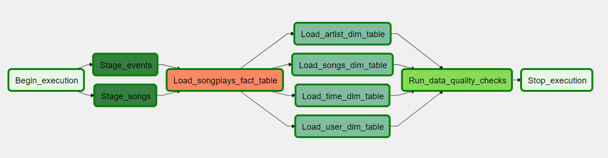
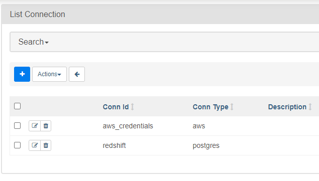

# Data-Pipelines-with-Airflow

> by Filipe Macedo 15 May 2021

## 1. Project Description

A music streaming company, Sparkify, has decided that it is time to introduce more automation and monitoring to their data warehouse ETL pipelines and come to the conclusion that the best tool to achieve this is Apache Airflow.  They have decided to bring you into the project and expect you to create high grade data pipelines that are dynamic and built from reusable tasks, can be monitored, and allow easy backfills. They have also noted that the data quality plays a big part when analyses are executed on top the data warehouse and want to run tests against their datasets after the ETL steps have been executed to catch any discrepancies in the datasets.



## 2. Datasets

We'll be working with two datasets that reside in S3. Here are the S3 links for each:

    Song data: s3://udacity-dend/song_data
    Log data: s3://udacity-dend/log_data

### Song Dataset

The first dataset is a subset of real data from the Million Song Dataset. Each file is in JSON format and contains metadata about a song and the artist of that song. The files are partitioned by the first three letters of each song's track ID. For example, here are filepaths to two files in this dataset.

    song_data/A/B/C/TRABCEI128F424C983.json
    song_data/A/A/B/TRAABJL12903CDCF1A.json

And below is an example of what a single song file, TRAABJL12903CDCF1A.json, looks like.

    {"num_songs": 1, "artist_id": "ARJIE2Y1187B994AB7", "artist_latitude": null, "artist_longitude": null, "artist_location": "", "artist_name": "Line Renaud", "song_id": "SOUPIRU12A6D4FA1E1", "title": "Der Kleine Dompfaff", "duration": 152.92036, "year": 0}

### Log Dataset

The second dataset consists of log files in JSON format generated by this event simulator based on the songs in the dataset above. These simulate app activity logs from an imaginary music streaming app based on configuration settings.

The log files in the dataset you'll be working with are partitioned by year and month. For example, here are filepaths to two files in this dataset.

    log_data/2018/11/2018-11-12-events.json
    log_data/2018/11/2018-11-13-events.json

## 3. Schema for Song Play Analysis

Using the song and event datasets, we'll need to create a star schema optimized for queries on song play analysis. This includes the following tables.

***Fact Table***

    songplay_table = records in event data associated with song plays i.e. records with page NextSong
        * songplay_id, start_time, user_id, level, song_id, artist_id, session_id, location, user_agent

***Dimension Tables***

    user_table = users in the app
        * user_id, first_name, last_name, gender, level
    song_table = songs in music database
        * song_id, title, artist_id, year, duration
    artist_table = artists in music database
        * artist_id, name, location, lattitude, longitude
    time_table = timestamps of records in songplays broken down into specific units
        * start_time, hour, day, week, month, year, weekday

## 4. How to run the project

### 4.1 Install  Airflow

There are many ways to run Airflow locally, I recommend you this [video](https://www.youtube.com/watch?v=aTaytcxy2Ck) where you will see how to run airflow using Docker Compose in less than 5 minutes.

### 4.2 Configure connections 

Using Airflow UI at http://localhost:8080 you need to add the connections to AWS and Redshift, you can see the example in the image bellow:



### 4.3 Running the DAG

You have two main DAGs, first run ```create_tables``` and after ```My dag```.